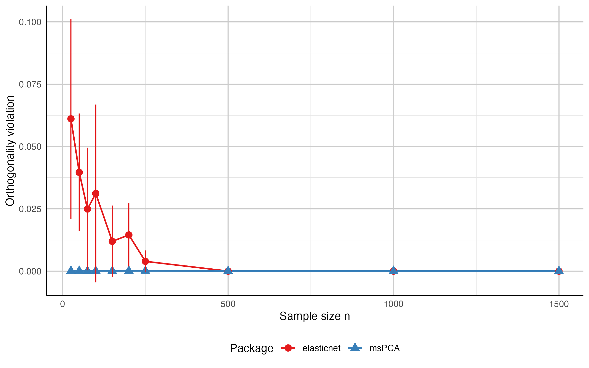
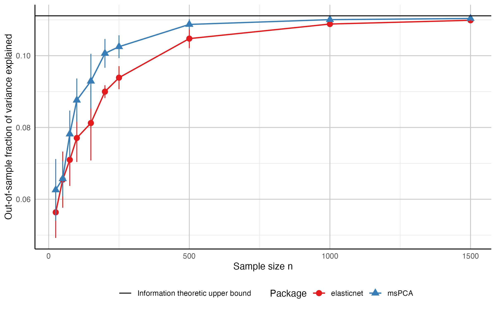

# msPCA

Sparse PCA with multiple principal components in R.

The `msPCA` package computes sparse loading vectors that explain a high fraction of variance while controlling non-redundancy across components. It supports two non-redundancy definitions:

- orthogonality of loading vectors,
- zero pairwise correlation of components.

## Installation

Install from CRAN:

```r
install.packages("msPCA")
library(msPCA)
```

Install development version from GitHub:

```r
install.packages("devtools")
devtools::install_github("jeanpauphilet/msPCA")
library(msPCA)
```

## Quick start

The main function is `mspca()`.

Inputs:

- `Sigma`: covariance or correlation matrix (`p x p`),
- `r`: number of sparse principal components,
- `ks`: integer vector of length `r` with sparsity budgets.

Output fields:

- `x_best`: sparse loading matrix (`p x r`),
- `objective_value`,
- `feasibility_violation`,
- `runtime`.

Example on `mtcars`:

```r
library(msPCA)

Sigma <- cor(datasets::mtcars)
set.seed(42)

res <- mspca(Sigma, r = 2, ks = c(4, 4), verbose = FALSE)
print_mspca(res, Sigma)

feasibility_violation_off(Sigma, res$x_best, feasibilityConstraintType = 0)
fraction_variance_explained(Sigma, res$x_best)
```

Optional dense PCA comparison:

```r
pca_res <- prcomp(datasets::mtcars, scale. = TRUE)
fraction_variance_explained(Sigma, pca_res$rotation[, 1:2])
```

Interpretation:

- Dense PCA usually explains more variance.
- Sparse PCA improves interpretability by restricting each component to a small set of features.

## Synthetic benchmark

The script `test/notebook_synthetic.R` compares `msPCA` with `elasticnet::spca()` on synthetic data across sample sizes and exports the figures below.





To regenerate these files, run `test/notebook_synthetic.R` from the repository root.

## Choosing parameters

### Sparsity budgets (`ks`)

`ks` is the main tuning input.
A practical workflow is to run `mspca()` for multiple sparsity budgets and evaluate:

- fraction of variance explained (`fraction_variance_explained()`),
- feasibility violation (`feasibility_violation_off()`),
- interpretability of nonzero loadings.

### Constraint type (`feasibilityConstraintType`)

- `0` (default): orthogonality constraints on loading vectors.
- `1`: zero pairwise correlation constraints on components.

Use `0` when loadings are used as a geometric projection basis.
Use `1` when statistical decorrelation of component scores is the priority.

## Main functions

- `mspca(Sigma, r, ks, ...)`: multiple sparse PCs.
- `tpm(Sigma, k, ...)`: single sparse PC via truncated power method.

Useful optional arguments in `mspca()`:

- `feasibilityConstraintType`
- `feasibilityTolerance`
- `maxIter`
- `stallingTolerance`
- `timeLimitTPM`
- `maxRestartTPM`
- `minRestartTPM`

## Diagnostic functions

- `fraction_variance_explained(Sigma, U)`
- `fraction_variance_explained_perPC(Sigma, U)`
- `variance_explained_perPC(Sigma, U)`
- `feasibility_violation_off(Sigma, U, feasibilityConstraintType)`
- `print_mspca(sol_object, Sigma, digits = 3)`

## Development

Package structure overview:

- `R/`
  - `main.R`: user-facing functions and helper diagnostics.
  - `RcppExports.R`: R interface for compiled code (typically generated with `Rcpp::compileAttributes()`).
- `src/`
  - `msPCA_R_CPP.cpp`: C++ implementation of the core algorithm.
  - `ConstantArguments.h`: internal algorithm constants.
  - `RcppExports.cpp`: generated C++ interface.
  - `Makevars`, `Makevars.win`: compilation settings.
- `man/`: function documentation generated from roxygen comments.
- `test/`
  - `notebook_mtcars.R`
  - `notebook_plot.R`
  - `notebook_synthetic.R`
  - `msPCA_synthetic_results.csv`

For interface changes, regenerate exports and documentation with `Rcpp::compileAttributes()` and `devtools::document()`.

## License

See `LICENSE`.

