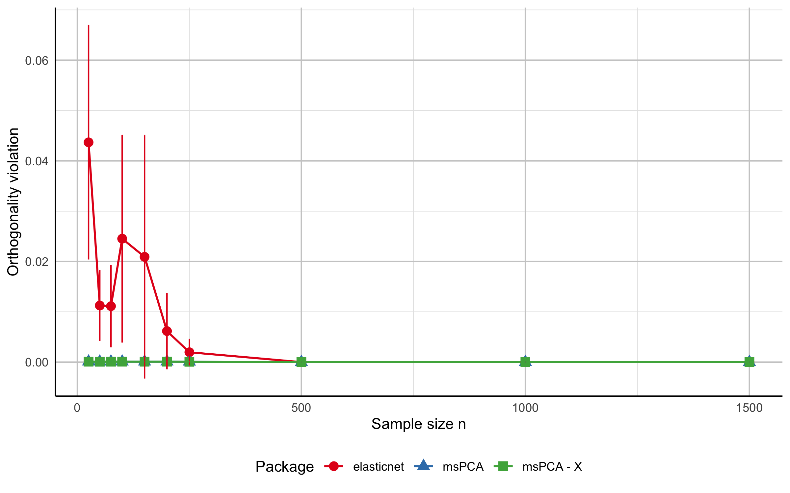
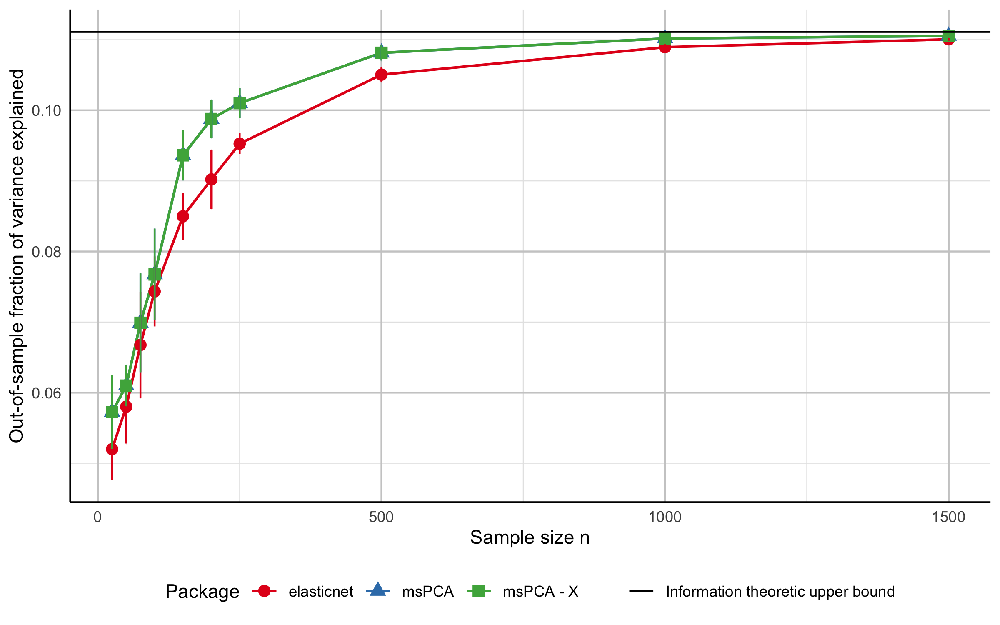

# msPCA

Sparse PCA with multiple principal components in R.

The `msPCA` package computes sparse loading vectors that explain a high fraction of variance while controlling non-redundancy across components. It supports two non-redundancy definitions:

- orthogonality of loading vectors,
- zero pairwise correlation of components.

## Installation

Install from CRAN:

```r
install.packages("msPCA")
library(msPCA)
```

Install development version from GitHub:

```r
install.packages("devtools")
devtools::install_github("jeanpauphilet/msPCA")
library(msPCA)
```

## Quick start

The main function is `mspca()`.

Inputs (following the `elasticnet` convention, the data is a single argument `M`
plus a `type` selector):

- `M`: the data matrix,
- `type`: `"Sigma"` (default) treats `M` as a covariance/correlation matrix
  (`p x p`); `"X"` treats `M` as a raw data matrix (`n` observations x `p`
  variables),
- `r`: number of sparse principal components,
- `ks`: integer vector of length `r` with sparsity budgets.

With `type = "X"`, `mspca()` applies the algorithm to the data directly via
the products `t(X) %*% (X %*% beta)` and never forms the `p x p` matrix. This is
substantially faster and more memory-efficient when `n << p`. Pass `type = "X"`
whenever the number of variables greatly exceeds the number of observations.

Output fields:

- `x_best`: sparse loading matrix (`p x r`),
- `objective_value`,
- `feasibility_violation`,
- `runtime`.

Example on `mtcars`:

```r
library(msPCA)

Sigma <- cor(datasets::mtcars)
set.seed(42)

res <- mspca(Sigma, r = 2, ks = c(4, 4), verbose = FALSE)   # type = "Sigma" is the default
print_mspca(res, Sigma)

feasibility_violation_off(Sigma, res$x_best, feasibilityConstraintType = 0)
fraction_variance_explained(Sigma, res$x_best)
```

Equivalent workflow from the raw data matrix (no covariance matrix needed):

```r
library(msPCA)

X <- as.matrix(datasets::mtcars)
set.seed(42)

# type = "X" treats the first argument as raw data; scale = TRUE operates on the
# correlation matrix, matching cor(mtcars) above.
res <- mspca(X, r = 2, ks = c(4, 4), type = "X", scale = TRUE, verbose = FALSE)
print_mspca(res)                      # type = "X" results carry their own variance summary

fraction_variance_explained(cor(X), res$x_best)
```

For datasets with `n << p`, this raw-data path avoids the `O(np^2)` cost of
forming `Sigma` and reduces each iteration's matrix–vector product from `O(p^2)`
to `O(np)`.

Optional dense PCA comparison:

```r
pca_res <- prcomp(datasets::mtcars, scale. = TRUE)
fraction_variance_explained(Sigma, pca_res$rotation[, 1:2])
```

Interpretation:

- Dense PCA usually explains more variance.
- Sparse PCA improves interpretability by restricting each component to a small set of features.

See `vignette("msPCA")` for a worked example built from the same `mtcars` workflow.

## Synthetic benchmark

The script `test/notebook_synthetic.R` compares `msPCA` with `elasticnet::spca()` on synthetic data across sample sizes and exports the figures below.





To regenerate these files, run `test/notebook_synthetic.R` from the repository root.

## Choosing parameters

### Sparsity budgets (`ks`)

`ks` is the main tuning input.
A practical workflow is to run `mspca()` for multiple sparsity budgets and evaluate:

- fraction of variance explained (`fraction_variance_explained()`),
- feasibility violation (`feasibility_violation_off()`),
- interpretability of nonzero loadings.

### Constraint type (`feasibilityConstraintType`)

- `0` (default): orthogonality constraints on loading vectors.
- `1`: zero pairwise correlation constraints on components.

Use `0` when loadings are used as a geometric projection basis.
Use `1` when statistical decorrelation of component scores is the priority.

## Main functions

- `mspca(M, r, ks, type = c("Sigma", "X"), ...)`: multiple sparse PCs.
- `tpm(M, k, type = c("Sigma", "X"), ...)`: single sparse PC via truncated power method.

Useful optional arguments in `mspca()`:

- `feasibilityConstraintType`
- `feasibilityTolerance`
- `maxIter`
- `stallingTolerance`
- `timeLimitTPM`
- `maxRestartTPM`
- `minRestartTPM`

Raw-data arguments (`type = "X"`):

- `center` (default `TRUE`), `scale` (default `TRUE`, set `FALSE` for covariance),
- `divisor` (`"n-1"` for the sample covariance, the default, or `"n"`).

Covariance-matrix validation arguments (`type = "Sigma"`):

- `checkPSD` (default `TRUE`), `symTolerance`, `psdTolerance`.

## Diagnostic functions

- `fraction_variance_explained(Sigma, U)`
- `fraction_variance_explained_perPC(Sigma, U)`
- `variance_explained_perPC(Sigma, U)`
- `feasibility_violation_off(Sigma, U, feasibilityConstraintType)`
- `print_mspca(sol_object, Sigma, digits = 3)`

## Citation

If you use `msPCA` in academic work, please cite the package and the underlying paper.

You can retrieve the package citation in R with:

```r
citation("msPCA")
```

Reference paper:

```bibtex
@article{cory2026sparse,
  title   = {Sparse PCA with Multiple Components},
  author  = {Cory-Wright, Ryan and Pauphilet, Jean},
  year    = {2026},
  journal = {Operations Research},
  doi     = {10.1287/opre.2023.0598}
}
```

## Development

Package structure overview:

- `R/`
  - `main.R`: user-facing functions and helper diagnostics.
  - `RcppExports.R`: R interface for compiled code (typically generated with `Rcpp::compileAttributes()`).
- `src/`
  - `msPCA_R_CPP.cpp`: C++ implementation of the core algorithm and the dense/raw-data entry points.
  - `CovOperator.h`: covariance-operator abstraction (`DenseOp` for `Sigma`, `GramOp` for `X`).
  - `ConstantArguments.h`: internal algorithm constants.
  - `RcppExports.cpp`: generated C++ interface.
  - `Makevars`, `Makevars.win`: compilation settings.
- `man/`: function documentation generated from roxygen comments.
- `test/`
  - `notebook_mtcars.R`
  - `notebook_plot.R`
  - `notebook_synthetic.R`
  - `msPCA_synthetic_results.csv`

For interface changes, regenerate exports and documentation with `Rcpp::compileAttributes()` and `devtools::document()`.

## License

See `LICENSE`.

