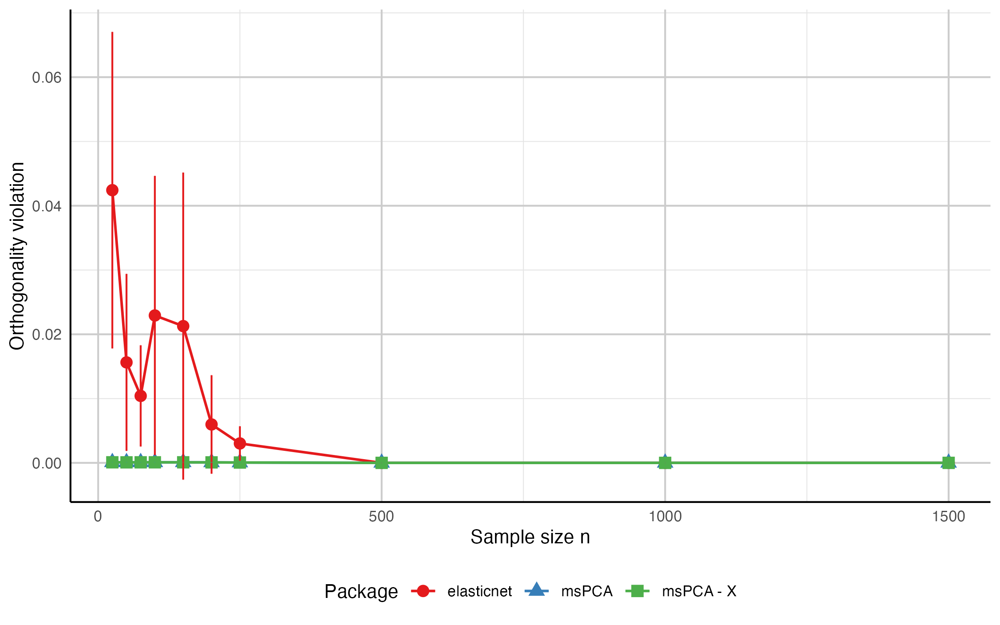
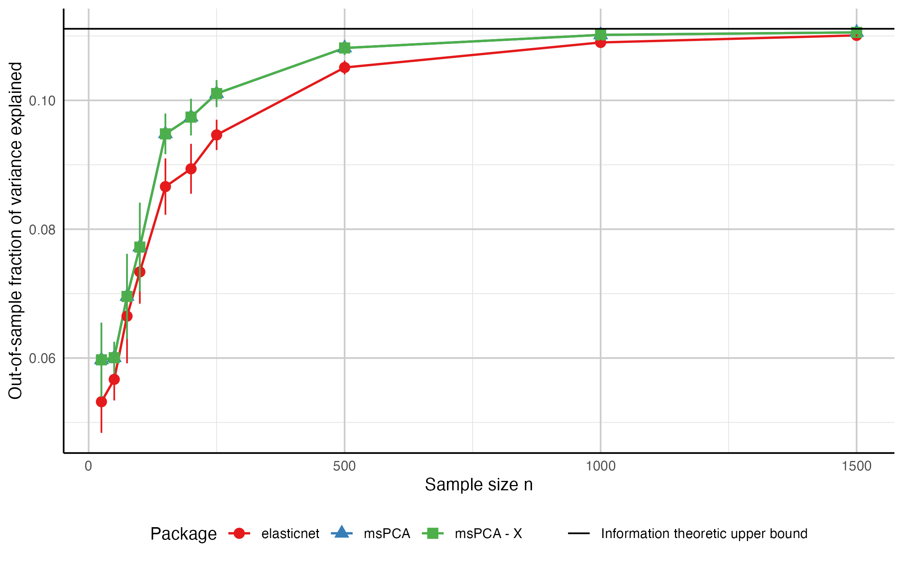

# msPCA

[](https://github.com/jeanpauphilet/msPCA/actions/workflows/R-CMD-check.yaml)
[](https://app.codecov.io/gh/jeanpauphilet/msPCA?branch=main)

Sparse PCA with multiple principal components in R.

The `msPCA` package computes sparse loading vectors that explain a high fraction of variance while controlling non-redundancy across components. It supports two non-redundancy definitions:

- orthogonality of loading vectors,
- zero pairwise correlation of components.

## Installation

Install from CRAN:

```r
install.packages("msPCA")
library(msPCA)
```

Install development version from GitHub:

```r
install.packages("devtools")
devtools::install_github("jeanpauphilet/msPCA")
library(msPCA)
```

## Quick start

The main function is `mspca()`.

Inputs (following the `elasticnet` convention, the data is a single argument `M`
plus a `type` selector):

- `M`: the data matrix,
- `type`: `"Sigma"` (default) treats `M` as a covariance/correlation matrix
  (`p x p`); `"X"` treats `M` as a raw data matrix (`n` observations x `p`
  variables),
- `r`: number of sparse principal components,
- `ks`: integer vector of length `r` with sparsity budgets.

With `type = "X"`, `mspca()` applies the algorithm to the data directly via the
products `t(X) %*% (X %*% beta)` and never forms the `p x p` matrix, which
reduces each iteration's matrix–vector product from `O(p^2)` to `O(np)`. Pass
`type = "X"` when the number of variables greatly exceeds the number of
observations; when `n > p` the dense `type = "Sigma"` path is cheaper.

Output fields:

- `x_best`: sparse loading matrix (`p x r`),
- `objective_value`,
- `feasibility_violation`,
- `runtime`,
- `feasibilityConstraintType`: the constraint enforced, reused as the default for
  all diagnostics,
- `nonredundancy`: the pairwise violation matrices under both constraint
  definitions, computed at fit time.

Example on `mtcars`:

```r
library(msPCA)

Sigma <- cor(datasets::mtcars)
set.seed(42)

res <- mspca(Sigma, r = 2, ks = c(4, 4), verbose = FALSE)   # type = "Sigma" is the default
print(res)
summary(res)

feasibility_violation_off(Sigma, res$x_best, feasibilityConstraintType = 0)
fraction_variance_explained(Sigma, res$x_best)
```

Equivalent workflow from the raw data matrix (no covariance matrix needed):

```r
library(msPCA)

X <- as.matrix(datasets::mtcars)
set.seed(42)

# type = "X" treats the first argument as raw data; scale = TRUE operates on the
# correlation matrix, matching cor(mtcars) above.
res <- mspca(X, r = 2, ks = c(4, 4), type = "X", scale = TRUE, verbose = FALSE)
print(res)
summary(res)

fraction_variance_explained(cor(X), res$x_best)
```

Optional dense PCA comparison:

```r
pca_res <- prcomp(datasets::mtcars, scale. = TRUE)
fraction_variance_explained(Sigma, pca_res$rotation[, 1:2])
```

Interpretation:

- Dense PCA usually explains more variance.
- Sparse PCA improves interpretability by restricting each component to a small set of features.

## Documentation

| Article | What it covers |
|---|---|
| [Worked example on `mtcars`](https://jeanpauphilet.github.io/msPCA/articles/msPCA.html) | The basic workflow: fitting, `print()`/`summary()`, the two constraint types, diagnostics. Start here. |
| [Case study: sparse factors in S&P 500 returns](https://jeanpauphilet.github.io/msPCA/articles/case-study-snp500.html) | A non-trivial application on the bundled `snp500` data (423 stocks), showing how the choice of non-redundancy constraint changes the factors recovered. |
| [Algorithm and implementation notes](https://jeanpauphilet.github.io/msPCA/articles/algorithm-and-implementation.html) | The optimization problem, both algorithms in full, implementation and complexity, and guidance on choosing `ks`, the constraint type and the iteration budgets. |
| [Benchmarking against other sparse PCA packages](https://jeanpauphilet.github.io/msPCA/articles/benchmarking.html) | `msPCA` against seven competing packages, eight functions in all, on four real datasets, with the exact configuration used for each. Website only — not shipped with the package. |

The first three are installed vignettes: after `install.packages("msPCA")`, run
`vignette(package = "msPCA")` to list them, or e.g.
`vignette("case-study-snp500", package = "msPCA")`.

## Choosing parameters

`ks` is the main tuning input, and `feasibilityConstraintType` selects the
notion of non-redundancy: `0` (default) enforces orthogonality of the loading
vectors, `1` enforces zero pairwise correlation of the components. Use `0`
when the loadings serve as a geometric projection basis, `1` when statistical
decorrelation of the component scores is the priority.

For a fuller treatment — how to sweep `ks` and read the resulting
sparsity/variance trade-off, when the two constraint types diverge, and how to
set `maxIter`, `maxRestartTPM` and `minRestartTPM` — see
[Algorithm and implementation notes](https://jeanpauphilet.github.io/msPCA/articles/algorithm-and-implementation.html).

## Synthetic benchmark

The script `notebooks/notebook_synthetic.R` compares `msPCA` with
`elasticnet::spca()` on synthetic data across sample sizes and exports the
figures below.





To regenerate these files, run `notebooks/notebook_synthetic.R` from the
repository root. It writes to `notebooks/`; copy the two PNGs into
`man/figures/` afterwards, since that is where this README and the website read
them from. For a broader comparison — seven competing packages on four real
datasets — see the
[benchmarking article](https://jeanpauphilet.github.io/msPCA/articles/benchmarking.html);
its replication scripts are in [`replication/`](replication).

## Main functions

- `mspca(M, r, ks, type = c("Sigma", "X"), ...)`: multiple sparse PCs.
- `tpm(M, k, type = c("Sigma", "X"), ...)`: single sparse PC via truncated power method.

`mspca()` returns an object of class `mspca` with `print()` and `summary()`
methods. Both read what they report from the fitted object, so neither needs the
covariance matrix passed back in. `summary()` reports the non-redundancy
violations under the constraint type used to fit; pass
`feasibilityConstraintType` explicitly to inspect the solution under the other
definition.

Useful optional arguments in `mspca()`:

- `feasibilityConstraintType`
- `feasibilityTolerance`
- `maxIter`
- `stallingTolerance`
- `timeLimitTPM`
- `maxRestartTPM`
- `minRestartTPM`

Raw-data arguments (`type = "X"`):

- `center` (default `TRUE`), `scale` (default `TRUE`, set `FALSE` for covariance),
- `divisor` (`"n-1"` for the sample covariance, the default, or `"n"`).

Covariance-matrix validation arguments (`type = "Sigma"`):

- `checkPSD` (default `TRUE`), `symTolerance`, `psdTolerance`.

## Diagnostic functions

- `fraction_variance_explained(Sigma, U)`
- `fraction_variance_explained_perPC(Sigma, U)`
- `variance_explained_perPC(Sigma, U)`
- `feasibility_violation_off(Sigma, U, feasibilityConstraintType)`, for scoring
  loadings that did not come from `mspca()`. Under
  `feasibilityConstraintType = 1` the violation is normalized by the average
  variance `tr(Sigma)/p`, making it invariant to a rescaling of `Sigma`.
- `print(sol_object, digits = 3)` / `summary(sol_object)`

## Included data

- `snp500`: the market-deflated correlation matrix of daily log-returns for 423
  S&P 500 constituents, January 2010 – December 2019 (`?snp500`). Used by the
  S&P 500 case study; derived from a CC0-licensed Kaggle dataset by
  `data-raw/snp500.R`.

## Citation

If you use `msPCA` in academic work, please cite the package and the underlying paper.

You can retrieve the package citation in R with:

```r
citation("msPCA")
```

Reference paper:

```bibtex
@article{cory2026sparse,
  title   = {Sparse PCA with Multiple Components},
  author  = {Cory-Wright, Ryan and Pauphilet, Jean},
  year    = {2026},
  journal = {Operations Research},
  doi     = {10.1287/opre.2023.0598}
}
```

## Development

Package structure overview:

- `R/`
  - `main.R`: user-facing functions and helper diagnostics.
  - `data.R`: documentation for the bundled `snp500` dataset.
  - `RcppExports.R`: R interface for compiled code, generated by `Rcpp::compileAttributes()`.
- `src/`
  - `msPCA_R_CPP.cpp`: C++ implementation of the core algorithm and the dense/raw-data entry points.
  - `CovOperator.h`: covariance-operator abstraction (`DenseOp` for `Sigma`, `GramOp` for `X`).
  - `ConstantArguments.h`: internal algorithm constants.
  - `RcppExports.cpp`: generated C++ interface.
  - `Makevars`, `Makevars.win`: compilation settings.
- `man/`: function documentation generated from roxygen comments.
- `vignettes/`: the three installed vignettes, plus `articles/` for the
  website-only benchmarking article (build-ignored).
- `data-raw/`: script and archival source for `data/snp500.rda` (build-ignored).
- `inst/vignette-data/`: pre-computed results read by the case-study vignette.
- `replication/`: scripts reproducing the benchmarking and case-study results
  reported in the paper and in the benchmarking article (build-ignored).
- `tests/testthat/`: unit tests.
- `notebooks/`
  - `notebook_mtcars.R`
  - `notebook_plot.R`
  - `notebook_synthetic.R`
  - `msPCA_synthetic_results.csv`

For interface changes, regenerate exports and documentation with `Rcpp::compileAttributes()` and `devtools::document()`. After editing `data-raw/snp500.R`, rebuild the dataset with `source("data-raw/snp500.R")`.

## License

See `LICENSE`.

