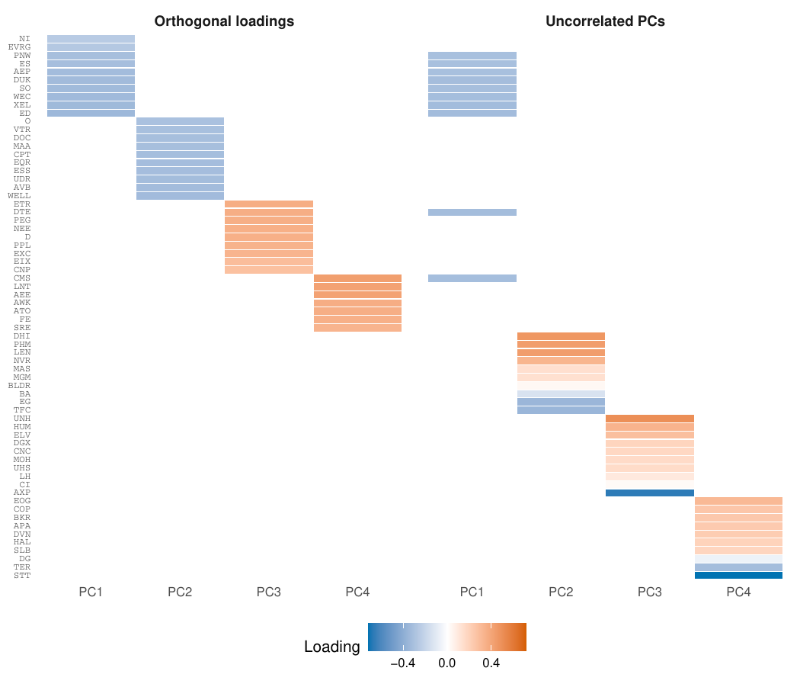

```{r setup, include = FALSE}
knitr::opts_chunk$set(collapse = TRUE, comment = "#>", eval = FALSE)
```

This vignette works through a complete, non-trivial application of `msPCA` to financial
return data. It illustrates the practical difference between the two notions of
non-redundancy that the package supports ---orthogonal loadings and uncorrelated principal
components--- and shows that the choice materially changes the factors you recover.

Every `msPCA` result below reproduces from data shipped with the package: no downloads, no
accounts, no external files. The fitting chunks are marked `eval = FALSE` only to keep the
vignette quick to build (the full sparsity grid takes several minutes). Note that the benchmark method,  
`nsprcomp` needs a data matrix rather than a correlation matrix.

## The data

The dataset `snp500` is the market-deflated correlation matrix of daily log-returns for
`p = 423` S&P 500 constituents with complete price histories from January 2010 to December
2019 (`n = 2,515` trading days).

```{r, eval = TRUE}
library("msPCA")
data(snp500)

dim(snp500)
round(snp500[1:4, 1:4], 3)
```

The matrix was constructed from the
[S&P 500 daily update dataset](https://www.kaggle.com/datasets/yash16jr/s-and-p500-daily-update-dataset)
on Kaggle, released under CC0 1.0. 
Typically, stock returns are dominated by a "market factor" that absorbs a disproportionate share of
total variance. To expose cross-sectional structure (sector and style effects) rather than market-wide movements, 
we projected out the leading eigenvector $v_1$ of the empirical correlation matrix
$\Sigma$, so $\texttt{snp500} = P^\top \Sigma P$ with
$P = I - v_1 v_1^\top$. The matrix is rank $p - 1=422$:

```{r, eval = TRUE}
ev <- eigen(snp500, symmetric = TRUE, only.values = TRUE)$values
sum(ev > 1e-8)          # 422: the market direction has been removed
```

The full data processing script is provided in `data-raw/snp500.R` in the package
repository, and `?snp500` documents the format. 

## Sparse factor extraction

We extract `r` = 4 sparse factors, each allowed to load on at most `k` stocks, varying `k`
from 5 to 35 in steps of 5 and running the analysis under both constraint types. The code
below produces the results for the orthogonality constraint
(`feasibilityConstraintType = 0`); setting `feasibilityConstraintType = 1` gives the zero
pairwise correlation results.

```{r}
ks_grid <- seq(5, 35, by = 5)

results <- lapply(ks_grid, function(k) {
  set.seed(42)
  res <- mspca(snp500, r = 4, ks = rep(k, 4), verbose = FALSE,
               maxIter = 100, feasibilityConstraintType = 0)
  data.frame(
    k      = k,
    fve    = fraction_variance_explained(snp500, res$x_best),
    orth   = feasibility_violation_off(snp500, res$x_best, 0),
    pwcorr = feasibility_violation_off(snp500, res$x_best, 1)
  )
})
results_df <- do.call(rbind, results)
```

We also run `nsprcomp::nsprcomp()` [@sigg2019nsprcomp] at the same budgets as a reference.
Note that `nsprcomp()` requires a data matrix rather than a covariance matrix, so it needs the
deflated returns `XR <- X %*% P` rather than `snp500`. That matrix is 2,515 x 423 and is not
shipped with the package; `data-raw/snp500.R` documents how to rebuild it from the raw prices.
We include a pre-computed comparison instead here, so the numbers below can be inspected and
re-plotted without a rerun:

```{r, eval = TRUE}
res_grid <- read.csv(system.file("vignette-data", "snp_varyingk_results.csv",
                                 package = "msPCA"))

ks  <- sort(unique(res_grid$k))
by_constraint <- function(cn) {
  sub <- res_grid[res_grid$constraint == cn, ]
  sub[match(ks, sub$k), c("fve", "orth_violation")]
}

tab <- cbind(k = ks,
             by_constraint("orthogonality"),
             by_constraint("zero-correlation"),
             by_constraint("nsprcomp"))

knitr::kable(
  tab, digits = 4, row.names = FALSE,
  col.names = c("k", "FVE (msPCA - orth)", "orth viol (msPCA - orth)", "FVE (msPCA - zero-corr)",
                "orth viol (msPCA - zero-corr)", "FVE (nsprcomp)", "orth viol (nsprcomp)"),
  caption = paste("FVE and orthogonality violation across the sparsity grid.",
                  "Every violation column reports the orthogonality violation,",
                  "including for the fits run under the zero-correlation constraint.")
)
```

## Comparing the two constraint types

The figures below report the fraction of variance explained (FVE), the orthogonality
violation, and the uncorrelatedness violation as a function of `k`, for `msPCA` under each
constraint type, against `nsprcomp::nsprcomp()` at the same sparsity budgets.

```{r, echo = FALSE, eval = TRUE, out.width = "32%", fig.show = "hold"}
knitr::include_graphics(c("figures/snp_fve.png",
                          "figures/snp_orth.png",
                          "figures/snp_pwcorr.png"))
```

*Left: fraction of variance explained vs. sparsity budget k. Center: orthogonality violation
vs. k. Right: uncorrelatedness violation vs. k. Results are shown for `msPCA` with
orthogonality constraints (blue, solid), `msPCA` with zero pairwise correlation constraints
(green, dashed), and `nsprcomp::nsprcomp()` (orange, dotted). All methods use r = 4
components.*

On this dataset, `nsprcomp::nsprcomp()` returns exactly orthogonal loading vectors for
small-to-moderate sparsity budgets (`k <= 20`), reflecting the effectiveness of the deflation
procedure when component supports can easily be disjoint. Beyond that orthogonality breaks: 
the violation is 0.015 at `k = 25`, 0.13 at `k = 30` and 0.020 at `k = 35`, and is not
monotone in `k`.

By contrast, `msPCA` with orthogonality constraints holds the violation at or below 1e-4 --- the
default feasibility tolerance --- at every budget from `k = 10` upward, because the penalty on
constraint violation is explicitly tightened throughout the algorithm.
In terms of FVE, both methods are comparable with a small edge for `nsprcomp::nsprcomp()`.

Neither `nsprcomp::nsprcomp()` nor orthogonality-constrained `msPCA` yields uncorrelated PCs
here. To obtain uncorrelated PCs we run `msPCA` with pairwise correlation constraints instead,
which yields PCs with near-zero pairwise correlation that are not mutually orthogonal. On this
dataset, requiring zero pairwise correlation rather than orthogonality is possible only at the
expense of a substantially lower FVE.

The two constraints correspond to different feasibility definitions and lead to meaningfully
different factor compositions. `msPCA` lets the user choose and enforce whichever is relevant
to their use case, with predictable behavior across the full range of sparsity levels.

## Interpreting the sparse components

Fixing `k = 10`, each factor loads on 10 stocks out of 423, making it possible to associate
each component with an economic theme. Sector labels below follow the Global Industry
Classification Standard [GICS; @msci2023gics].

```{r}
set.seed(42)
res_orth <- mspca(snp500, r = 4, ks = rep(10, 4), verbose = FALSE,
                  maxIter = 100, feasibilityConstraintType = 0)
set.seed(42)
res_corr <- mspca(snp500, r = 4, ks = rep(10, 4), verbose = FALSE,
                  maxIter = 100, feasibilityConstraintType = 1)

print(res_orth)
print(res_corr)
```

`summary()` on either fit reports the violations under the constraint that fit
enforced, and labels them as such:

```{r}
summary(res_orth)
summary(res_corr)
```

```{r, echo = FALSE, eval = TRUE, out.width = "95%"}

```

*Loadings of the 4 PCs (sparsity k = 10) returned by `msPCA` with orthogonality (left) or
zero-correlation (right) constraints.*

### Under orthogonality constraints

The four PCs concentrate entirely within the utility and REIT sectors, with no cross-sector
loadings. Each PC has 10 nonzeros by construction, but a few are numerically negligible
(below 1e-4); the economically meaningful names are:

- **PC1** loads on regulated electric utilities (AEP, DUK, ED, ES, EVRG, NI, PNW, SO, WEC, XEL).
- **PC2** consolidates the REIT segment into a single component spanning residential apartments
  (AVB, CPT, EQR, ESS, MAA, UDR), healthcare REITs (DOC, WELL, VTR), and net-lease (O).
- **PC3** captures a second, non-overlapping utility cluster (CNP, D, DTE, EIX, ETR, EXC, NEE,
  PEG, PPL).
- **PC4** identifies a third utility subgroup (AEE, ATO, AWK, CMS, FE, LNT, SRE).

The orthogonality constraint therefore fragments the market into three disjoint utility
clusters and one diversified REIT basket, with each PC loading exclusively on one sector. The
four components carry comparable weight, explaining 2.13%, 1.62%, 1.52% and 1.21% of total
variance respectively.

### Under zero-correlation constraints

The components are more sector-diverse, and their supports overlap rather than partitioning the
universe --- Consolidated Edison (ED) appears in all four. Variance is also far more
concentrated in the leading component: 2.28%, 0.67%, 0.61% and 0.55%, against a much flatter
profile under orthogonality.

- **PC1** consolidates the entire utility sector into a single broad component (AEP, CMS, DTE,
  DUK, ED, ES, PNW, SO, WEC, XEL), merging stocks that the orthogonality constraint split
  across three separate PCs.
- **PC2** is an energy component: oil and gas exploration (APA, DVN) and oilfield services
  (BKR, HAL, SLB) load together at around 0.40--0.44, alongside ED at 0.29, against small
  negative loadings on Dollar General (DG), State Street (STT) and Teradyne (TER).
- **PC3** identifies pharmaceutical distribution ---McKesson (MCK), Cardinal Health (CAH) and
  Cencora (COR) all load above 0.51--- extended by generics (VTRS) and diagnostics (LH),
  against Best Buy (BBY) and, more weakly, KLA (KLAC) and Air Products (APD).
- **PC4** is a mega-cap technology component: Alphabet's two share classes (GOOG, GOOGL) load at
  about -0.60, with Amazon (AMZN) at -0.38 and Microsoft (MSFT) at -0.22, against positive
  loadings on Best Buy (BBY) and Quanta Services (PWR).

Signs are arbitrary up to a global flip within each component; what matters is the contrast
between the positively and negatively loaded groups.

## Takeaway

Orthogonality and zero pairwise correlation are not interchangeable. On strongly correlated
data they recover qualitatively different factor structures. On this stock return data, orthogonality 
returns disjoint supports spends all four components inside two sectors: three separate
utility clusters and one REIT basket. Zero pairwise correlation, on the other hand, 
returns overlapping supports and recovers four distinct themes instead ---utilities, energy, pharmaceutical distribution and
mega-cap technology--- each expressed as a contrast between positively and negatively loaded
groups. We also observe a difference in the distribution of variance explained by each PC: 
under zero correlation the leading component carries most
of the explained variance (2.28% against 0.55--0.67% for the others), whereas orthogonality
spreads it more evenly (2.13% down to 1.21%), and total FVE is markedly lower with zero-correlation constraints 
at every sparsity budget.

## References
